# SecureStart

SecureStart is a full-stack cybersecurity training application for **NovaShield Learning**, a fictional digital training company. It helps junior developers and non-technical employees understand AI-related security risks through short modules, scenario-based quizzes and a progress dashboard.

## Project links

- **[Final Figma design](https://www.figma.com/design/1YWZ73QjdYHnsUwS8r77NQ/SecureStart-Design?node-id=10-6&p=f)**
- **[Interactive desktop prototype](https://www.figma.com/proto/1YWZ73QjdYHnsUwS8r77NQ/SecureStart-Design?node-id=93-34&starting-point-node-id=93%3A34&scaling=scale-down&content-scaling=fixed)**
- **[Interactive mobile prototype](https://www.figma.com/proto/1YWZ73QjdYHnsUwS8r77NQ/SecureStart-Design?node-id=93-1055&starting-point-node-id=93%3A1055&scaling=scale-down&content-scaling=fixed)**
- **Live application: [securestart.onrender.com](https://securestart.onrender.com/)**
- **API link: [securestart-api.onrender.com/swagger-ui/#](https://securestart-api.onrender.com/swagger-ui/#/)**
- **Word count: 2,047 words (excluding headers and tables)**

## Contents

1. [Product Proposal &amp; Design](#1-product-proposal--design)
2. [Planning &amp; Requirements](#2-planning--requirements)
3. [Full-Stack Development](#3-full-stack-development)
   - [3.1 Architecture overview](#31-architecture-overview)
   - [3.2 Technology choices](#32-technology-choices)
   - [3.3 Authentication and security](#33-authentication-and-security)
   - [3.4 API and persistence](#34-api-and-persistence)
   - [3.5 Implemented learner flow](#35-implemented-learner-flow)
4. [Testing &amp; Deployment](#4-testing--deployment)
   - [4.2 Representative TDD cycle](#42-representative-tdd-cycle)
   - [4.3 Coverage and behavioural testing](#43-coverage-and-behavioural-testing)
   - [4.4 Continuous integration and deployment](#44-continuous-integration-and-deployment)
5. [Evaluation](#5-evaluation)

## 1. Product Proposal & Design

### 1.1 Product overview

**NovaShield Learning** is a fictional digital training company helping organisations teach employees safe software and AI-assisted working practices. As workplace AI use grows, junior developers and non-technical employees may not fully understand risks including insecure generated code, phishing, weak authentication and data leakage.

**SecureStart** addresses this through short cybersecurity modules, scenario-based quizzes and progress tracking. Users authenticate through Auth0, complete training and receive quiz feedback, giving organisations a lightweight way to support safer use of AI and software tools.

### 1.2 Product-design approach

I designed SecureStart iteratively through five connected layers: foundations, reusable components, patterns and templates, responsive screens, and an interactive prototype. Foundations defined colours, typography and accessibility; reusable components established consistent interface structures; responsive screens applied them across desktop and mobile; and the prototype connected the learner journey. This made later logo and responsive refinements easier to apply consistently.

*Figure 1. SecureStart foundations defining the shared visual and accessibility rules used by later components and screens.*

### 1.3 Why I selected Figma

I selected Figma because it supported SecureStart's design system, responsive screens and interactive prototype in one place. Components, variants and variables kept colours, spacing and repeated elements consistent, while side-by-side desktop and mobile layouts helped me review navigation and branding before implementation. Named components and design tokens also provided a practical reference for React development.

### 1.4 Component-based design

SecureStart uses a layered, component-based approach:

| Design layer | Examples                                                                                                                      |
| ------------ | ----------------------------------------------------------------------------------------------------------------------------- |
| Foundations  | colour variables, Manrope typography, spacing, border radius and icon rules                                                   |
| Components   | buttons, badges, progress bars, navigation items, alerts and quiz answers                                                     |
| Patterns     | `ProductHeader`, `ModuleCard`, `QuizProgressHeader`, `QuizQuestionPanel`, `ResultSummary` and Auth0 redirect prompt |
| Screens      | landing, dashboard, module, quiz and results pages                                                                            |
| Prototype    | connected desktop and mobile journeys with validation and selected-answer states                                              |

*Figure 2. Reusable interface components created from the shared foundations before being applied to complete screens.*

Components were combined into reusable patterns before full screens were built, keeping headers, module cards and quiz panels consistent.

*Figure 3. Components combined into repeatable patterns and templates before full-screen design.*

Status information combines text, icons and colour rather than relying on colour alone, while progress indicators use the same structure across cards and summary views. This maps directly to reusable React components.

### 1.5 Visual identity

**NovaShield Learning** is the fictional parent company and **SecureStart** its cybersecurity training product. SecureStart remains the primary product name, supported by a NovaShield endorsement. The identity uses Manrope, a dark navy base, electric teal for primary actions and progress, violet as an accent, and a custom shield mark.

*Figure 4. SecureStart shield explorations and the final logo selected for the product identity.*

I tested three shield variations before selecting a simpler design with a stronger outline so it remained recognisable at smaller sizes. Conventional icons are reserved for functional actions so branding is not confused with interactive controls.

### 1.6 Accessibility decisions

Accessibility was considered from the foundations stage. SecureStart uses strong foreground/background contrast, clear action labels and consistent navigation. Status and progress combine text, icons and colour so meaning does not rely on colour alone.

Responsive layouts preserve logical content order and usable touch targets, while selected, completed, disabled and error states remain distinguishable. Further keyboard and screen-reader testing would be needed beyond completed visual and behavioural checks.

### 1.7 Sustainability decisions

I considered sustainability by limiting unnecessary design, development and runtime overhead. SecureStart was kept to a focused MVP rather than expanding into non-essential administration, certificate or analytics features.

Reusable components, simple shapes and vector icons reduce duplicated code and heavy media. Unnecessary animation is avoided and data is requested only when needed, keeping the product simpler to maintain and operate.

### 1.8 User journey and interactions

The primary learner journey moves from the landing page through Auth0 authentication, dashboard, module, quiz and results before returning to an updated dashboard. This keeps the application focused on completing training and seeing progress.

| Screen    | Key interaction                                       |
| --------- | ----------------------------------------------------- |
| Landing   | User selects**Log in** or **Get started** |
| Auth0     | User signs in through Universal Login                 |
| Dashboard | User selects a training module                        |
| Module    | User reads the content and starts the quiz            |
| Quiz      | User selects answers and submits                      |
| Results   | Score, feedback and next action are displayed         |
| Dashboard | Stored progress is reflected in the interface         |

*Figure 5. Primary user journey, including the external Auth0 authentication step and updated dashboard state.*

The prototype also covers answer selection, incomplete-quiz validation and separate desktop and mobile starting points. Authentication is represented as an external redirect because credential handling takes place through Auth0 Universal Login.

*Figure 6. Interactive prototype connecting the primary learner journey and key alternative states before implementation.*

### 1.9 Responsive design and iteration

SecureStart was designed around a **1280 px desktop viewport** and **375 px mobile checkpoint**. Mobile layouts stack content into one reading column, simplify the product header and retain the same content order and primary actions.

*Figure 7. Landing-page designs showing how the product introduction, branding and feature cards adapt between desktop and mobile layouts.*

I compared desktop and mobile screens throughout prototyping. This led to simplified mobile navigation, additional quiz states and refinement of the original shield after it proved too detailed at smaller sizes.

*Figure 8. Dashboard iteration showing the same progress information and training modules reorganised for desktop and mobile layouts.*

## 2. Planning & Requirements

### 2.1 Project management approach

I used **GitHub Projects** because it keeps requirements, issues, branches and pull requests connected to the same repository, providing traceability from planned work through implementation and review.

I organised work using **Backlog**, **In progress**, **In review** and **Done** states, supported by priority and size fields. This helped separate essential MVP work from lower-priority enhancements and provided a clear view of progress throughout development.

*Figure 9. SecureStart project board during the design phase, showing the completed foundation work and product-design tasks in progress.*

The board was updated throughout the project rather than being used only for initial planning. By the final review, 31 items had been completed across the main SecureStart epics.

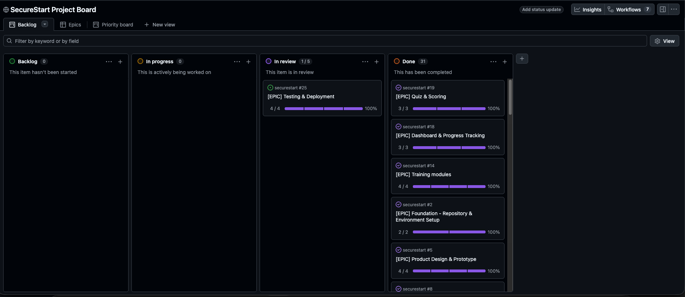

*Figure 10. Final project-board state showing the progression of the main epics from early development to completion or review.*

### 2.2 Epic and ticket structure

I organised SecureStart into epics representing larger project outcomes, with smaller implementation tickets linked beneath them. The seven epics covered **Foundation – Repository & Environment Setup**, **Product Design & Prototype**, **Authentication**, **Training Modules**, **Dashboard & Progress Tracking**, **Quiz & Scoring**, and **Testing & Deployment**.

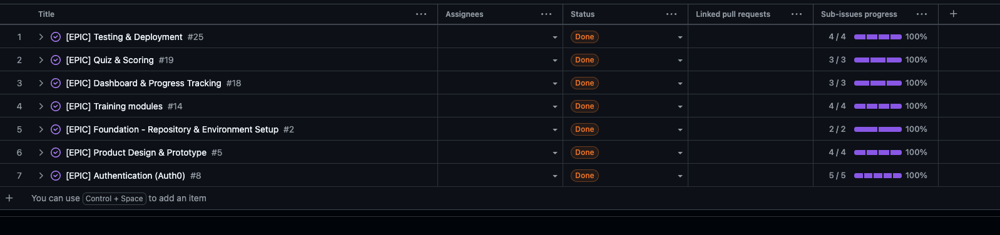

*Figure 11. SecureStart epic overview showing all seven project epics, their linked sub-issues and final completion status.*

Each ticket contained acceptance criteria defining observable conditions required for completion. This kept individual tasks small enough to implement and test independently while each epic represented a broader project objective.

*Figure 12. Completed Foundation epic demonstrating how smaller implementation tickets contribute to a larger project outcome.*

### 2.3 Acceptance criteria and definition of done

Acceptance criteria were written to describe testable outcomes rather than simply stating that code should be created. The environment configuration ticket required documented frontend and backend variables, `.env.example` templates and real secrets to remain outside version control.

*Figure 13. Representative ticket demonstrating testable acceptance criteria for configuration and secret handling.*

A ticket was considered complete when its acceptance criteria were satisfied, relevant tests passed, the implementation was committed and documentation was updated where required.

### 2.4 Branch and pull-request workflow

Implementation work was completed on dedicated branches and merged into `main` through pull requests, with related issues linked so changes remained traceable to their requirements.

*Figure 14. Foundation setup pull request linking completed implementation work back to the relevant GitHub issues.*

### 2.5 Representative requirements and scope control

Security-sensitive requirements were also expressed as tickets. For example, Auth0 token verification required signature, issuer, audience and expiry checks before protected data access, while quiz-attempt requirements defined server-side scoring and authenticated-user persistence.

To keep the project achievable within the coursework timeframe, the MVP intentionally excluded features such as an admin dashboard, certificates, leaderboards, role-based permissions and advanced analytics. This kept development focused on the core authenticated learner journey while leaving non-essential features for future iterations.

## 3. Full-Stack Development

### 3.1 Architecture overview

SecureStart uses a separated **client-server architecture** within a single repository. The React/Vite frontend is deployed as a Render static site and communicates with a Rust/Axum REST API hosted separately on Render. **MongoDB Atlas** provides persistence, while **Auth0** handles authentication and identity.

Protected frontend requests include an Auth0 access token. The Axum API verifies the token before any protected database access, ensuring the frontend never communicates directly with MongoDB.

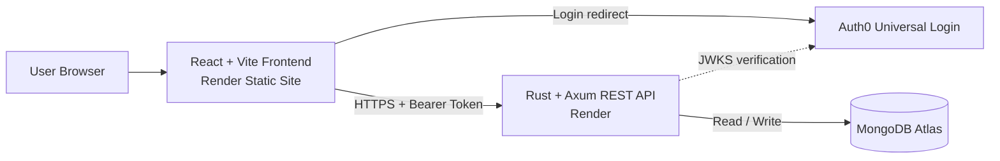

*Figure 15. SecureStart high-level architecture showing the frontend, Auth0, Axum API and MongoDB Atlas.*

### 3.2 Technology choices

| Layer          | Technology     | Reason                                                                |
| -------------- | -------------- | --------------------------------------------------------------------- |
| Frontend       | React + Vite   | Reusable interactive components and lightweight build tooling         |
| Backend        | Rust + Axum    | Strong typing, explicit error handling and REST routing               |
| Database       | MongoDB Atlas  | Flexible document storage for users, modules and quiz attempts        |
| Authentication | Auth0 / OIDC   | Delegates credential handling while allowing backend JWT verification |
| Hosting        | Render         | Separate deployment of static frontend and API                        |
| CI/CD          | GitHub Actions | Automated testing, coverage and production builds                     |

React suited SecureStart because repeated interface elements such as module cards, quiz controls and progress indicators map naturally to reusable components. I selected **Rust with Axum** for the backend because Rust's type system and explicit error handling support predictable behaviour in security-sensitive API code.

MongoDB suited the document-based training modules and learner records without requiring the frontend to embed or manage training data directly.

### 3.3 Authentication and security

I delegated authentication to **Auth0** rather than building password storage and token issuance myself. I also considered a self-built bcrypt/JWT approach and Clerk. Auth0 was selected because its standards-based OIDC model allowed the Rust backend to verify tokens using standard JWT/JWKS handling while credential storage, password reset and account security remained with a specialist provider.

The trade-off is dependency on a third-party identity service and redirect-based login, which I accepted to reduce the amount of security-critical authentication code maintained by SecureStart.

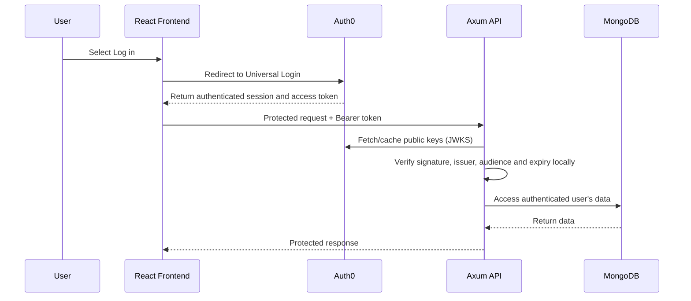

*Figure 16. Authentication sequence showing Auth0 login and backend JWT verification before MongoDB access.*

On first authenticated access, the backend provisions a local user keyed by the Auth0 `sub` claim and reuses that record on later requests. Passwords are never stored by SecureStart. Protected routes reject missing or invalid tokens with sanitised errors, CORS restricts requests to the deployed frontend, secrets remain in environment variables and production traffic uses HTTPS.

### 3.4 API and persistence

SecureStart exposes protected REST endpoints for training modules, quiz attempts and learner progress. Repository interfaces separate route behaviour from MongoDB access, which also allows the same API behaviour to be tested using in-memory repositories.

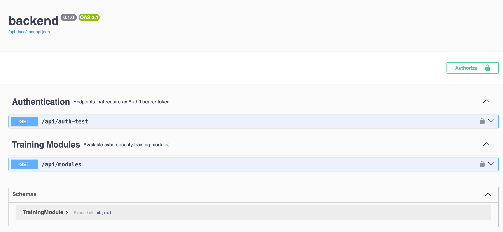

*Figure 17. Deployed Swagger documentation showing the protected SecureStart API routes.*

Training content is stored in MongoDB and seeded through an idempotent command that upserts the four MVP modules without creating duplicates.

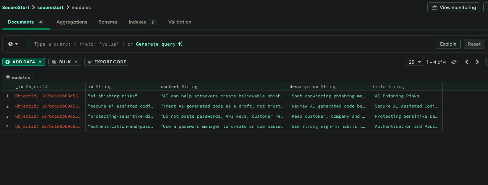

*Figure 18. MongoDB Atlas collection containing the four seeded SecureStart training modules.*

Quiz answers are submitted to the Axum API rather than scored in the browser. The backend validates the submission, calculates the score, associates the attempt with the authenticated user and stores it for later progress queries. This prevents the client from deciding its own result and keeps progress isolated between users.

### 3.5 Implemented learner flow

The React frontend combines module data with the authenticated learner's stored progress. Completion, best-score and retake states therefore reflect persisted API data rather than static interface values.

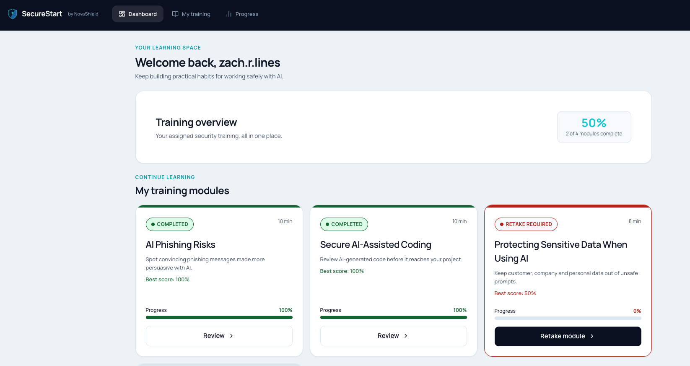

*Figure 19. Implemented dashboard presenting API-backed progress for the authenticated learner.*

The implemented interface also retains the responsive behaviour established during prototyping, reorganising the same learner content for smaller screens without changing the underlying workflow.

After quiz submission, the results page displays the server-calculated score, feedback and next action.

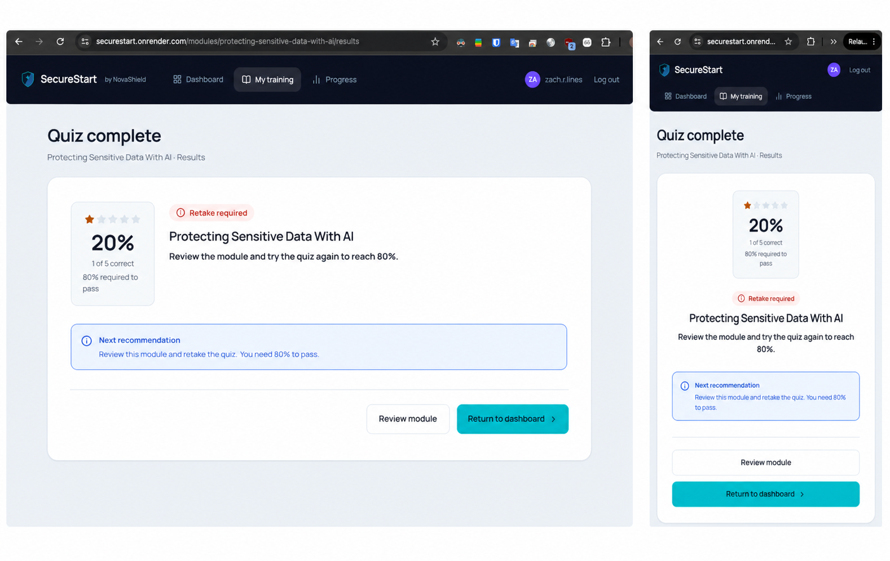

*Figure 20. Implemented SecureStart desktop and mobile results views demonstrating responsive behaviour and the persisted server-scored quiz outcome.*

Together, these views demonstrate the working **React → Axum → MongoDB** learner flow with Auth0 protecting the data boundary.

## 4. Testing & Deployment

### 4.1 Testing approach

The frontend uses **Vitest with React Testing Library** to test rendered components and learner behaviour rather than implementation details. Auth0 is mocked so tests can exercise authenticated and unauthenticated states without depending on the live identity provider.

Backend tests use Rust's test framework with in-memory repository and authentication doubles. Route-level requests therefore pass through the Axum router without requiring MongoDB Atlas or Auth0, allowing API behaviour, security boundaries and error handling to be tested in isolation.

### 4.2 Representative TDD cycle

Below is the progress API as an example of my **RED -> GREEN** cycle. Five tests were written first to define the required empty state, user isolation, best-score aggregation, sanitised repository failures and rejection of unauthenticated requests before database access. All five initially failed because the required route behaviour had not yet been implemented.

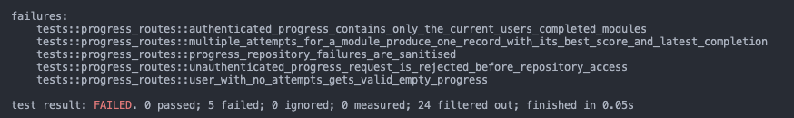

*Figure 21. TDD RED: the five progress-route requirements failing before implementation.*

After implementing the authenticated route and repository behaviour, the same five tests passed.

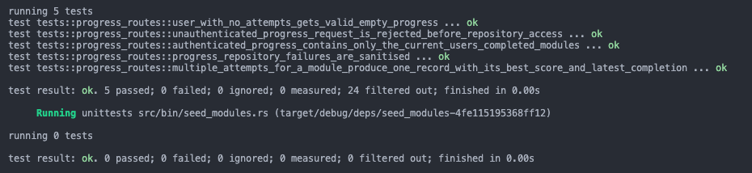

*Figure 22. TDD GREEN: the same progress-route requirements passing after implementation.*

This provides a direct trace between expected behaviour and the completed implementation.

### 4.3 Coverage and behavioural testing

| Application                      | Tests | Statements / regions | Branches | Functions |  Lines |
| -------------------------------- | ----: | -------------------: | -------: | --------: | -----: |
| Frontend                         |    48 |               96.67% |   85.85% |    85.29% | 96.67% |
| Backend (all executable sources) |    36 |               41.13% |      n/a |    56.99% | 44.24% |

| Learner-facing behaviour                             | Line coverage |
| ---------------------------------------------------- | ------------: |
| Authenticated user provisioning (`/api/auth-test`) |       100.00% |
| Module list, detail and quiz-question routes         |       100.00% |
| User-isolated progress route                         |       100.00% |
| Server-scored quiz-attempt route                     |        98.39% |

The final frontend suite contains **48 tests** with **96.67% statement coverage**. Tests cover authentication-aware requests, module navigation, quiz interaction, validation, results and progress states.

The backend contains **36 tests**. Its overall **44.24% line coverage** includes infrastructure and operational code outside the isolated route tests, including MongoDB start-up, Auth0 JWKS networking and module seeding. Learner-facing API routes tested directly achieve approximately **98–100% line coverage**, including user provisioning, modules, progress and server-side quiz scoring.

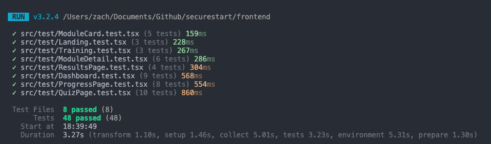

*Figure 23. Final frontend suite covering component behaviour and the main learner routes.*

### 4.4 Continuous integration and deployment

GitHub Actions runs frontend and backend checks on pushes and pull requests targeting `main`, including automated tests, coverage, frontend linting and production builds. This provides automated feedback before changes are merged.

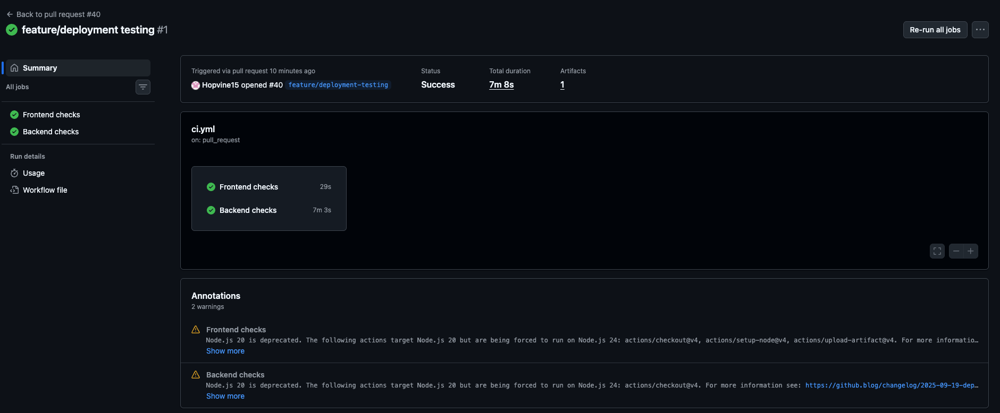

*Figure 24. GitHub Actions confirming successful frontend and backend checks on the deployment pull request.*

The React frontend and Axum API are deployed separately on **Render**, with MongoDB Atlas providing persistence and deployment configuration stored outside version control. The live application and Swagger API links at the top of the README provide access to the completed system.

## 5. Evaluation

### 5.1 Design and implementation

SecureStart achieved its main goal of providing a complete learner journey from authentication through training modules, quizzes, results and progress tracking. The component-based Figma approach translated effectively into React, particularly for repeated structures such as module cards, quiz controls and progress states.

Using **Rust with Axum** required more learning than the React frontend, especially around error handling and shared application state. This increased development time, but Rust's explicit types and error handling helped make backend behaviour predictable and encouraged clearer handling of failure cases.

### 5.2 Security and testing

Delegating authentication to **Auth0** was effective because SecureStart did not need to store passwords or implement credential-management flows itself. The backend still retained control of authorisation by verifying tokens before protected data access.

Repository abstractions also proved useful because routes could be tested without requiring live MongoDB or Auth0 services. Server-side quiz scoring was another important decision because the frontend cannot determine or persist its own result, helping protect the integrity of learner progress data.

Automated testing and GitHub Actions provided useful regression protection. However, overall backend coverage remains lower than the frontend because operational code such as MongoDB start-up, JWKS networking and module seeding is not exercised as heavily by the isolated route tests.

### 5.3 Limitations and future improvements

The current MVP contains only four seeded training modules and has no administrative interface for managing content. Future development could expand the number of training modules, introduce configurable quiz pass thresholds and improve the progress experience.

Accessibility could also be evaluated further through dedicated keyboard and screen-reader testing. Stronger automated integration testing against deployed services would provide additional confidence in infrastructure and external-service behaviour.

### 5.4 AI Usage Statement

I used **Claude** on approximately two to three occasions to support debugging during development. For example, when the backend could not connect to MongoDB Atlas, Claude helped me interpret the console error and identify that my current IP address needed to be added to the MongoDB Atlas network access allowlist. I applied and verified the configuration change myself.

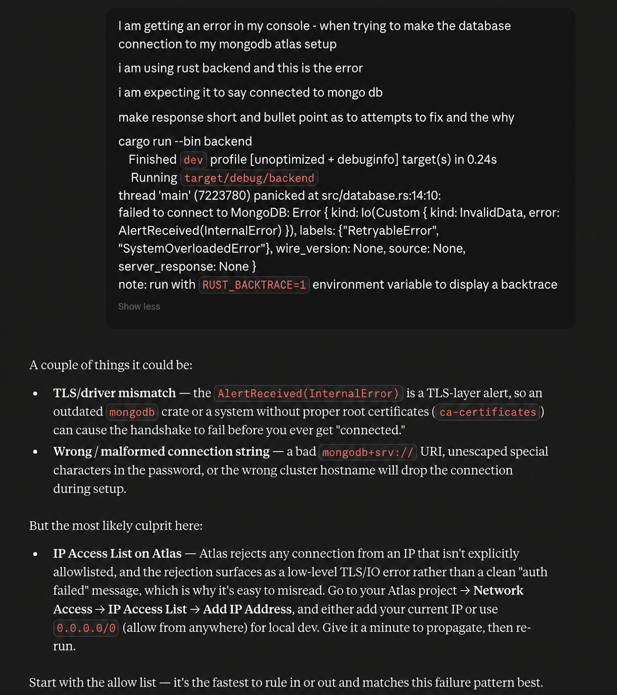

*Figure 25. Example of AI-assisted debugging used to investigate the MongoDB Atlas connection error and identify relevant configuration checks.*
