# SecureStart

SecureStart is a full-stack cybersecurity training application for **NovaShield Learning**, a fictional digital training company. It helps junior developers and non-technical employees understand AI-related security risks through short modules, scenario-based quizzes and a progress dashboard.

## Project links

- **[Final Figma design](https://www.figma.com/design/1YWZ73QjdYHnsUwS8r77NQ/SecureStart-Design?node-id=10-6&p=f)**
- **[Interactive desktop prototype](https://www.figma.com/proto/1YWZ73QjdYHnsUwS8r77NQ/SecureStart-Design?node-id=93-34&starting-point-node-id=93%3A34&scaling=scale-down&content-scaling=fixed)**
- **[Interactive mobile prototype](https://www.figma.com/proto/1YWZ73QjdYHnsUwS8r77NQ/SecureStart-Design?node-id=93-1055&starting-point-node-id=93%3A1055&scaling=scale-down&content-scaling=fixed)**
- **Live application:** n/a

## Contents

1. [Product overview](#product-overview)
2. [Product-design approach](#product-design-approach)
3. [Why I selected Figma](#why-i-selected-figma)
4. [Component-based design](#component-based-design)
5. [Visual identity](#visual-identity)
6. [Accessibility decisions](#accessibility-decisions)
7. [Sustainability decisions](#sustainability-decisions)
8. [User journey and interactions](#user-journey-and-interactions)
9. [Responsive design and iteration](#responsive-design-and-iteration)
10. [Planning and requirements](#planning-and-requirements)
11. [Technical direction](#technical-direction)
12. [Repository structure](#repository-structure)
13. [Environment variables](#environment-variables)

## Product overview

Organisations are increasingly adopting AI tools, but employees may not fully understand the risks of AI-generated code, phishing, weak authentication, data leakage or over-trusting AI output.

SecureStart addresses this through a focused learning journey:

- short cybersecurity modules
- realistic scenario-based quiz questions
- immediate results and feedback
- progress tracking through a personal dashboard
- authentication through Auth0 Universal Login.

The main users are junior developers using AI coding tools, non-technical staff using AI at work, and team leads who need lightweight visibility of training completion.

## Product-design approach

I developed the design iteratively rather than drawing each screen independently. I worked through five connected layers:

1. **Foundations** - brand colours, typography, spacing, radii, icon treatment and accessibility principles.
2. **Components** - reusable buttons, badges, progress indicators, navigation items, alerts and quiz controls.
3. **Patterns and templates** - combinations such as the product header, module card, quiz panel and authentication prompt.
4. **Responsive screens** - landing, dashboard, module, quiz and results layouts for desktop and mobile.
5. **Interactive prototype** - the happy path and key alternative states were connected and tested as one journey.

Working this way let me test decisions at a smaller level before repeating them across the application. It also made changes such as the logo refinement easier to apply consistently across the screens and prototype.

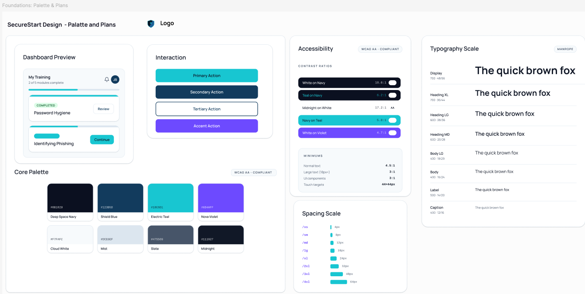

*Figure 1. SecureStart foundations defining the shared visual and accessibility rules used by the later components and screens.*

## Why I selected Figma

I selected Figma because it let me define reusable variables, components and configurations within the same design file.

- **Reusable design system:** I could define components, variants and variables once and reuse them.
- **Responsive exploration:** I could compare desktop and mobile frames in the same file.
- **Interactive prototyping:** I could connect screens into a realistic user journey before implementation.
- **Iteration:** I could review branding, navigation and component states before development.
- **Development hand-off:** named layers, components and design tokens provide a reference for the React implementation.

This kept the design system, screen layouts and prototype behaviour in one place.

## Component-based design

SecureStart uses a layered, component-based approach:

| Design layer | Examples                                                                                                                      |
| ------------ | ----------------------------------------------------------------------------------------------------------------------------- |
| Foundations  | colour variables, Manrope typography, spacing, border radius and icon rules                                                   |
| Components   | buttons, badges, progress bars, navigation items, alerts and quiz answers                                                     |
| Patterns     | `ProductHeader`, `ModuleCard`, `QuizProgressHeader`, `QuizQuestionPanel`, `ResultSummary` and Auth0 redirect prompt |
| Screens      | landing, dashboard, module, quiz and results pages                                                                            |
| Prototype    | connected desktop and mobile journeys with validation and selected-answer states                                              |

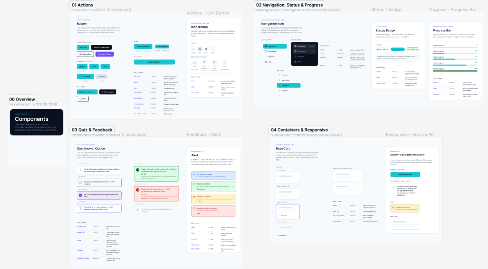

*Figure 2. Reusable interface components created from the shared foundations before being applied to complete screens.*

I combined the individual components into reusable patterns and templates before building full screens. This kept repeated structures such as product headers, module cards and quiz panels consistent.

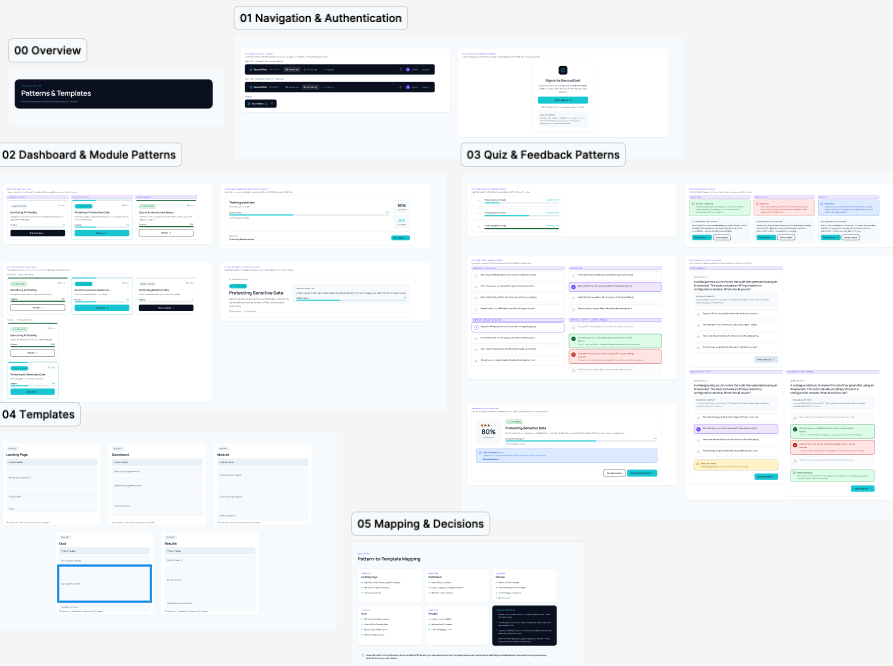

*Figure 3. Components combined into repeatable patterns and templates before full-screen design.*

I reused the same component language across different contexts. Status uses a badge, label and visual treatment rather than colour alone, while progress bars use the same structure on cards and summary panels. This reduces visual inconsistency and maps more directly to reusable React components.

## Visual identity

**NovaShield Learning** is the fictional parent company and **SecureStart** is its cybersecurity training product. The relationship is shown through an endorsement text “A NovaShield Learning product” or “by NovaShield”, while SecureStart remains the primary name inside the application.

The identity uses:

- **Manrope** for a clear and modern interface;
- a dark navy base to communicate trust and security;
- electric teal as the primary action and progress colour;
- violet as a supporting brand accent;
- simple geometric interface icons;
- a custom shield mark for product branding.

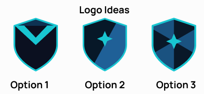

*Figure 4. SecureStart shield explorations and the final logo selected for the product identity.*

I created the SecureStart shield, using existing shield logos and patterns as visual references. I looked at examples such as the Clash of Clans badge system, especially how bold outlines and simple internal shapes remain  distinctive at small sizes. I explored three variations of shield pattern's before choosing the final design.

The final logo system includes:

- a full logo with the parent-brand endorsement;
- a standard icon-and-wordmark lock-up for headers;
- a compact shield mark for small spaces.

Functional interface actions continue to use simple icons, while the custom shield is reserved for SecureStart branding.

## Accessibility decisions

I considered accessibility from the foundations stage rather than adding it after the screens were complete.

- Text and controls use strong foreground/background contrast.
- Information is not communicated through colour alone; badges include labels and icons.
- Buttons use clear action wording such as **Start module**, **Continue** and **Submit answer**.
- Navigation placement and visual hierarchy remain consistent across authenticated screens.
- Focus, disabled, selected, completed and error states are designed to remain distinguishable.
- Content follows a logical order that is preserved when it stacks on mobile.
- The logo was kept simple so it remains legible at all sizes.
- Heavy motion and unnecessary animation are avoided.
- Auth0 Universal Login is treated as an external authentication step and should be configured with readable labels and accessible brand colours.

These choices support accessibility, although the implemented application will still require keyboard, screen-reader and automated contrast testing.

## Sustainability decisions

I kept the design focused on avoiding unnecessary digital and development overhead.

- Reusable components reduce duplicated design and frontend code.
- A focused MVP avoids designing and building unused features.
- Screens use simple shapes, typography and lightweight vector icons instead of large media assets.
- Unnecessary animation and heavy visual effects are avoided.
- The flat vector shield can scale without separate raster assets for each size.
- Responsive layouts reuse the same content and component structure rather than creating unrelated mobile experiences.
- Data is intended to be requested only when required for each screen.
- Auth0 reduces the amount of security-critical authentication code that must be built, tested and maintained.

Sustainability is therefore treated as a combination of efficient interface assets, maintainable implementation and controlled project scope.

## User journey and interactions

The primary journey is:

1. The user opens the SecureStart landing page.
2. They select **Log in** or **Get started**.
3. SecureStart redirects them to Auth0 Universal Login.
4. After authentication, the user returns to the dashboard.
5. They choose a training module.
6. They read the module and start the quiz.
7. They select answers and submit the quiz.
8. The results page shows the score, feedback and next recommendation.
9. The user returns to an updated dashboard showing new progress.

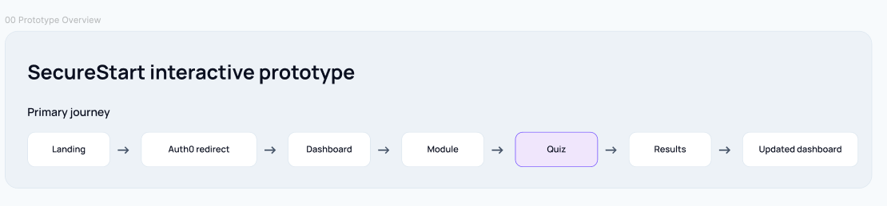

*Figure 5. Primary user journey, including the external Auth0 authentication step and the updated dashboard state.*

Key prototype interactions include:

- landing-page actions that open the represented Auth0 redirect step;
- module cards and calls to action that open the selected module;
- a module-to-quiz transition;
- answer selection;
- incomplete-quiz validation;
- quiz submission and results;
- return to the updated dashboard;
- separate desktop and mobile starting points.

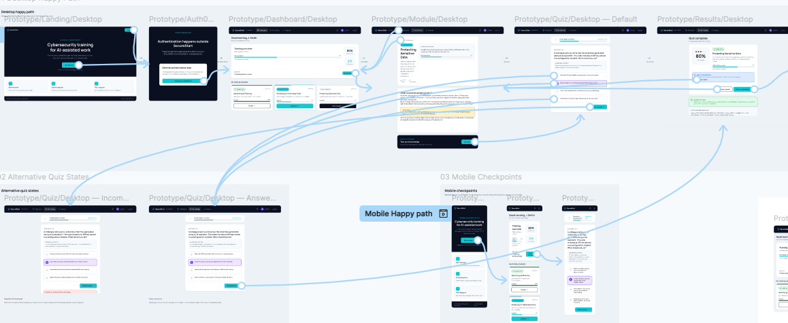

*Figure 6. Interactive prototype flow connecting the primary journey and allowing the key interactions to be reviewed before implementation.*

I represented authentication as an external step because SecureStart does not collect or store passwords.

## Responsive design and iteration

I designed the desktop layouts around a 1280 px application viewport and used 375 px mobile checkpoints.

The mobile designs do not simply shrink the desktop screens. They:

- stack cards and content into one reading column;
- simplify the product header;
- keep the most important progress information visible;
- retain the same content order and actions;
- increase wrapping where needed rather than reducing text to unreadable sizes;
- keep buttons large enough to remain clear touch targets.

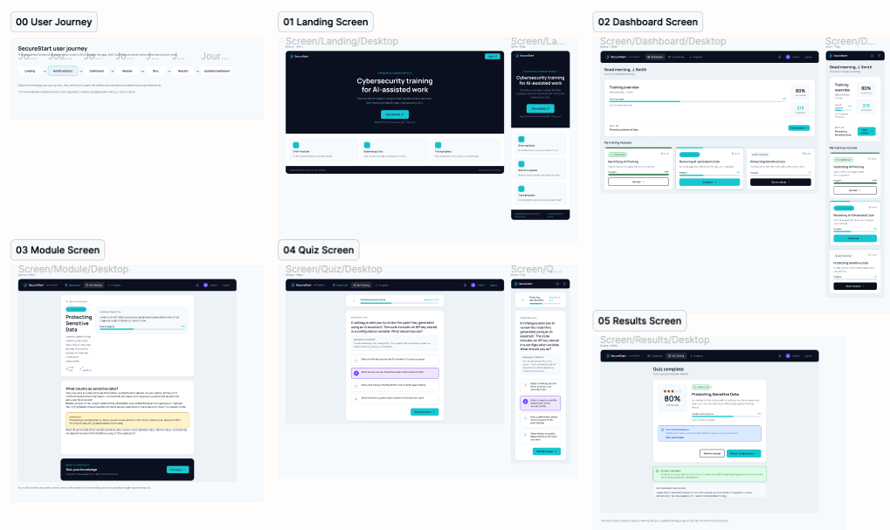

*Figure 7. Landing-page designs showing how the product introduction, branding and feature cards adapt between desktop and mobile layouts.*

I first checked components in isolation, then combined them into patterns and full screens. I compared desktop and mobile layouts, added alternative quiz states and replaced the original detailed logo with a simpler mark after testing it at small sizes.

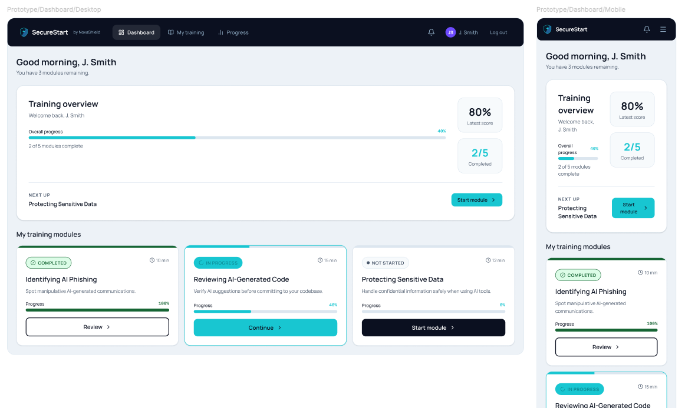

*Figure 8. Dashboard iteration showing the same progress information and training modules reorganised for desktop and mobile layouts.*

## Planning and requirements

### Project management approach

I use **GitHub Projects** to manage SecureStart because it keeps the project board, issues, branches and pull requests connected to the same repository. This gives me traceability between requirements and their implementation without maintaining a separate project-management system.

I use a Kanban-style workflow with **Backlog**, **In progress**, **In review** and **Done** states. Priority and size fields help me distinguish the importance and scope of work, and I move tickets across the board as development progresses.

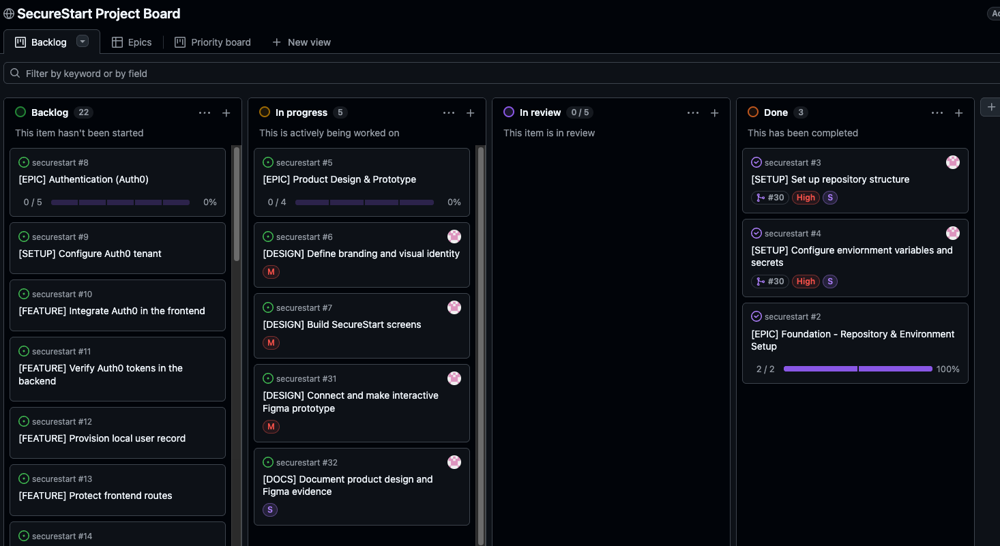

*Figure 9. SecureStart project board during the design phase, showing the completed foundation work and product-design tasks in progress.*

At this stage, the repository foundation was complete and the product-design epic had moved into active development.

### Epic and ticket structure

I organised the work into **epics** representing larger project outcomes, with smaller implementation tickets linked underneath them. Each ticket has acceptance criteria so I can judge completion against observable outcomes rather than whether code has simply been written.

The first completed epic was **Foundation – Repository & Environment Setup**. Its purpose was to establish the repository structure and environment configuration required before feature development could begin.

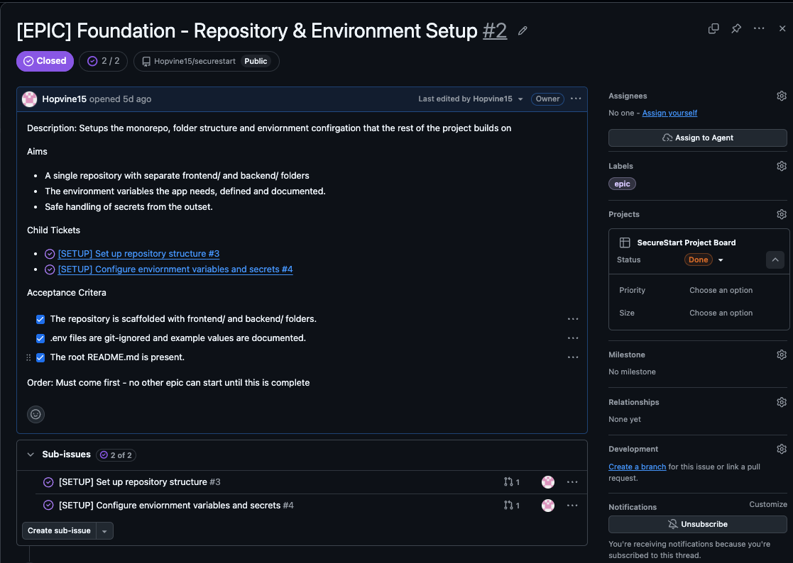

*Figure 10. Completed Foundation epic containing the repository-structure and environment-configuration child tickets.*

Separating repository setup from environment configuration kept the individual tasks small and independently testable, while the epic still represented the larger setup objective.

### Acceptance criteria and definition of done

The repository setup ticket required separate React/Vite `frontend/` and Rust/Axum `backend/` folders, Git-ignored environment files and a root README.

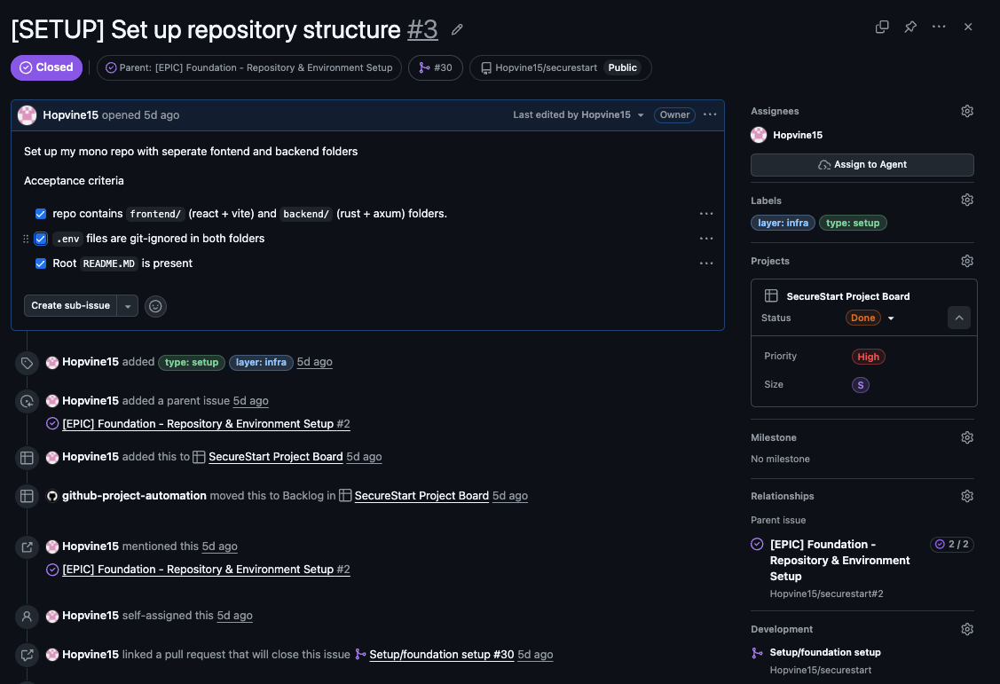

*Figure 11. Repository setup ticket after its specific acceptance criteria were satisfied.*

I kept environment configuration as a separate setup ticket. Its acceptance criteria required the frontend and backend variable names to be documented, `.env.example` templates to be provided and real secrets to remain outside version control.

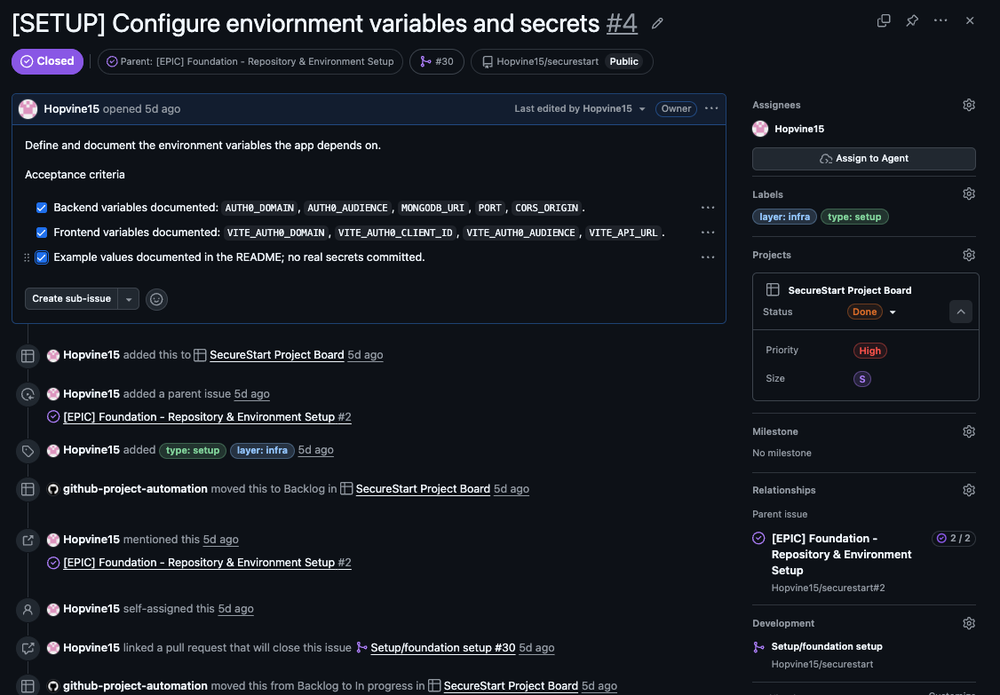

*Figure 12. Environment configuration ticket demonstrating testable requirements for configuration and secret handling.*

I consider a ticket complete when its acceptance criteria are met, relevant tests pass, the work is committed to GitHub and the documentation is updated where needed. This gives each ticket a consistent completion standard.

### Branch and pull-request workflow

I carry out implementation work on a dedicated branch and merge it into `main` through a pull request. I link related issues to the pull request so the completed code can be traced back to its requirements.

I completed the initial foundation work on the `setup/foundation-setup` branch and merged it through pull request **#30**. The pull request contained separate commits for the React/Vite frontend scaffold, Rust/Axum backend scaffold and environment-variable documentation.

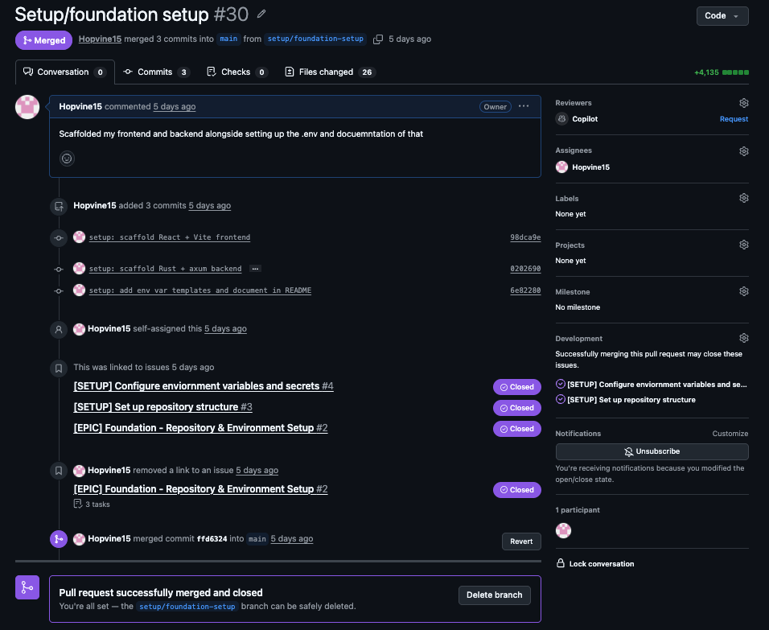

*Figure 13. Foundation setup pull request linking completed implementation work back to the relevant GitHub issues.*

### Representative feature requirements

I used feature tickets to turn security and core application behaviour into specific, testable requirements.

- **#11 – Verify Auth0 tokens in the backend:** I used this ticket to make sure JWT signature, issuer, audience and expiry are checked before protected data is accessed, with invalid tokens returning safe errors.
- **#20 – Build quiz attempts and scoring API:** I used this ticket to define how quiz attempts are submitted and stored, with each attempt linked to the authenticated user and the final score calculated on the backend.

## Technical direction

| Layer            | Technology                                          |
| ---------------- | --------------------------------------------------- |
| Frontend         | React + Vite                                        |
| Backend          | Rust + Axum                                         |
| Database         | MongoDB Atlas                                       |
| Authentication   | Auth0 using OIDC and hosted Universal Login         |
| Frontend testing | Vitest + React Testing Library                      |
| Backend testing  | Rust test framework with route-level test utilities |
| CI/CD            | GitHub Actions                                      |
| Frontend hosting | Vercel                                              |
| Backend hosting  | Render                                              |

The repository uses separate `frontend/` and `backend/` folders within one repository. It is a separated full-stack application, not a microservices architecture.

## Testing and coverage

The frontend uses Vitest with React Testing Library and a mocked Auth0 client. The backend uses Rust unit and route-level tests with in-memory repository doubles, so validation does not require a live MongoDB instance or Auth0 tenant.

Install the Rust coverage tool once with `cargo install cargo-llvm-cov --locked`, then run the checks from each application directory:

```bash
# frontend/
npm run coverage

# backend/
cargo llvm-cov --all-targets --summary-only
```

Coverage was captured on 14 August 2026 after the test suites were expanded:

| Application | Tests | Statements / regions | Branches | Functions | Lines |
| ----------- | ----: | -------------------: | -------: | --------: | ----: |
| Frontend | 48 | 96.67% | 85.85% | 85.29% | 96.67% |
| Backend (all executable sources) | 36 | 41.13% | n/a | 56.99% | 44.24% |

The backend total is a deliberately broad number, not a score for learner-facing API behaviour. It includes operational code that should be validated in deployment rather than unit tests: live MongoDB setup, production server start-up, Auth0 JWKS network verification and the standalone module-seeding binary.

The API routes exercised by the automated tests have the following line coverage:

| Learner-facing behaviour | Line coverage |
| ------------------------ | ------------: |
| Authenticated user provisioning (`/api/auth-test`) | 100.00% |
| Module list, detail and quiz-question routes | 100.00% |
| User-isolated progress route | 100.00% |
| Server-scored quiz-attempt route | 98.39% |

The user-provisioning route tests cover first login, repeat login without a duplicate user, unauthenticated rejection before storage access, and sanitised repository errors. This keeps the coverage focus on security-sensitive and user-visible behaviour while the live infrastructure path is verified separately during deployment.

## Repository structure

```text
securestart/
├── assets/
│   ├── 1-product-proposal-design/
│   │   ├── securestart-components-design.png
│   │   ├── securestart-dashboard-responsive.png
│   │   ├── securestart-foundations.png
│   │   ├── securestart-patternstemplates-design.png
│   │   ├── securestart-prototype-flow.png
│   │   ├── securestart-screens-design.png
│   │   └── securestart-user-journey.png
│   └── 2-planning-requirements/
│       ├── environment-configruation-ticket-complete.png
│       ├── foundation-epic-complete.png
│       ├── foundation-setup-pull-requrest-merged.png
│       ├── initial-repository-structure.png
│       ├── respository-setup-ticket-complete.png
│       └── securestart-github-project-board-design-phase.png
├── backend/
├── frontend/
├── architecture-notes.md
├── planning.md
├── product-notes.md
├── user-journey.md
└── README.md
```

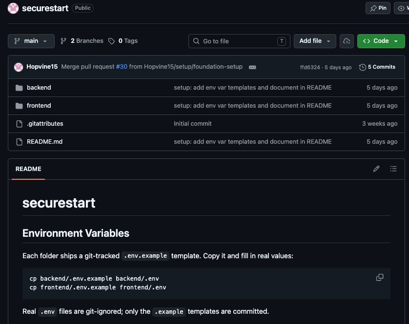

*Figure 14. Repository structure created as the implementation outcome of the Foundation setup epic.*

## Environment variables

Each application folder includes a Git-tracked `.env.example` template. Copy each template and provide the real local values:

```bash
cp backend/.env.example backend/.env
cp frontend/.env.example frontend/.env
```

Real `.env` files are ignored by Git; only the example templates are committed.

### Seed training modules

After configuring `backend/.env`, seed the initial cybersecurity modules explicitly:

```bash
cd backend
cargo run --bin seed_modules
```

The command upserts the four MVP modules by their application-facing `id`, so it
can be run again to update the same records without creating duplicates. It does
not run when the API starts.

### `backend/.env.example`

```dotenv
AUTH0_DOMAIN=         # Auth0 tenant domain
AUTH0_AUDIENCE=       # Auth0 API identifier the token must match
MONGODB_URI=          # MongoDB Atlas connection string
PORT=                 # Port used by the Axum API
CORS_ORIGIN=          # Deployed frontend URL allowed by CORS
```

### `frontend/.env.example`

```dotenv
VITE_AUTH0_DOMAIN=    # Auth0 tenant domain
VITE_AUTH0_CLIENT_ID= # Auth0 SPA application client ID
VITE_AUTH0_AUDIENCE=  # Auth0 API identifier
VITE_API_URL=         # Backend API base URL
```

I use `.env.example` files to document the required configuration without committing real secrets.
